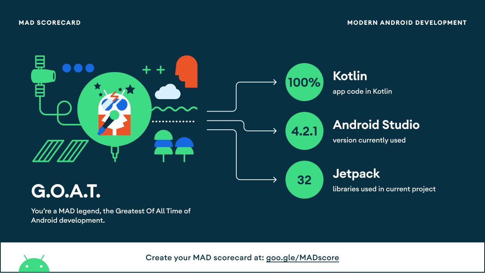
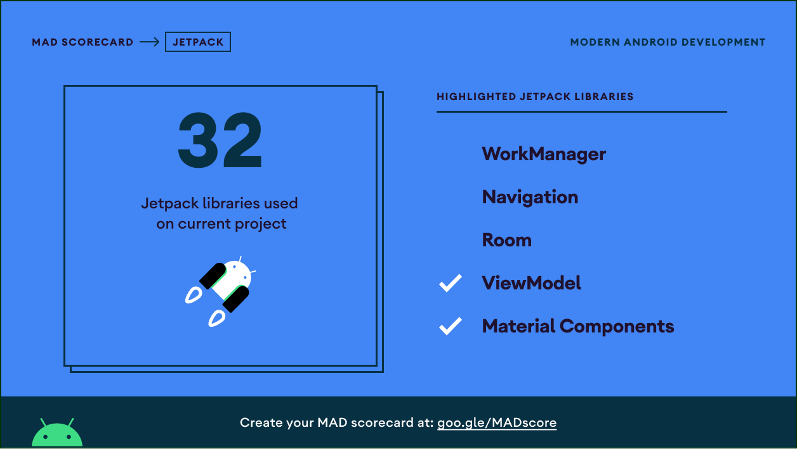

# Filmpedia &middot;   

**Filmpedia** is an unofficial Android movie information application using TMDB API.

This project is using famous Android tech-stacks like Kotlin, Coroutines, Retrofit, Glide and other.
It's architecture is based on MVVM (Model-View-ViewModel) and Repository Pattern.
I hope it can be good sample to Android developers and leaners.

## Features

- Popular, now playing and high rated movie list
- Movie detail information
- Person detail information
- Movie searching

## Tech Stacks

- **[Kotlin](https://github.com/JetBrains/kotlin)**: First programming language for Android development
- **Coroutine**: An asyncroneous processing method
- **MVVM + Repository**: Application architecture
- **Git**: Version control

## Open Source Libraries

- [Kotlinx.Coroutines](https://github.com/Kotlin/kotlinx.coroutines) (Apache-2.0 License)
- [Android Jetpack Libraries](https://github.com/androidx/androidx) (Apache-2.0 License)
  - [Core](https://github.com/androidx/androidx/tree/androidx-main/core)
  - [Activity](https://github.com/androidx/androidx/tree/androidx-main/activity)
  - [Appcompat](https://github.com/androidx/androidx/tree/androidx-main/appcompat)
  - [Constraint Layout](https://github.com/androidx/constraintlayout)
  - [Fragment](https://github.com/androidx/androidx/tree/androidx-main/fragment)
  - [Lifecycle](https://github.com/androidx/androidx/tree/androidx-main/lifecycle)
  - [ViewPager2](https://github.com/androidx/androidx/tree/androidx-main/viewpager2)
- [Material Components](https://github.com/material-components/material-components-android) (Apache-2.0 License)
- [Retrofit](https://github.com/square/retrofit) (Apache-2.0 License)
- [Okhttp](https://github.com/square/okhttp) (Apache-2.0 License)
- [Glide](https://github.com/bumptech/glide) ([Custom License](https://github.com/bumptech/glide/blob/master/LICENSE))

## Architecture

Filmpedia is based on MVVM (Model-View-ViewModel) architecture + Repository pattern.


<div align="right">
    <small>
        &lt;Image from <a href="https://developer.android.com/jetpack/guide?gclid=CjwKCAjw1JeJBhB9EiwAV612y_g-BW7h2BTGnW3IppKi9ZqdxaOpgKO02VhcRUCzH-7ECMUs7Q7F9RoCcbQQAvD_BwE&gclsrc=aw.ds">Android Developers&gt;</a>.
    </small>
</div>

## Package Structure

```
.
├─ data: data classes
├─ network: Retrofit instance and services
├─ repository: Repository classes
├─ ui
│  ├─ component: Custom views
│  └─ page: Each activities, fragments, viewmodels and adapters
│      ├─ home
│      ├─ moviedetail
│      └─ ...
└─ util: Utility functions, classes and objects
```

## Open API

Filmpedia is using [TMDB API](https://developers.themoviedb.org/3).

TMDB API provides thousands of movie's information and RESTful API.

If you want to build on your local, create your API key.
And add below line in to `local.properties`.

```
api.key="Your TMDB API key"
```

## MAD Score

MAD (Modern Android Development) Score is a score card service provided by Google.






<div align="right">
    <small>
        &lt;Score based on Filmpedia x.x.x version&gt;
    </small>
</div>

## License

Filmpedia app is licensed under the [Apache-2.0 License](./LICENSE).

Material Icons made by Google and licensed under the [Apache-2.0 License](http://www.apache.org/licenses/LICENSE-2.0.txt).

Logo made by Jaewoong Cheon.
